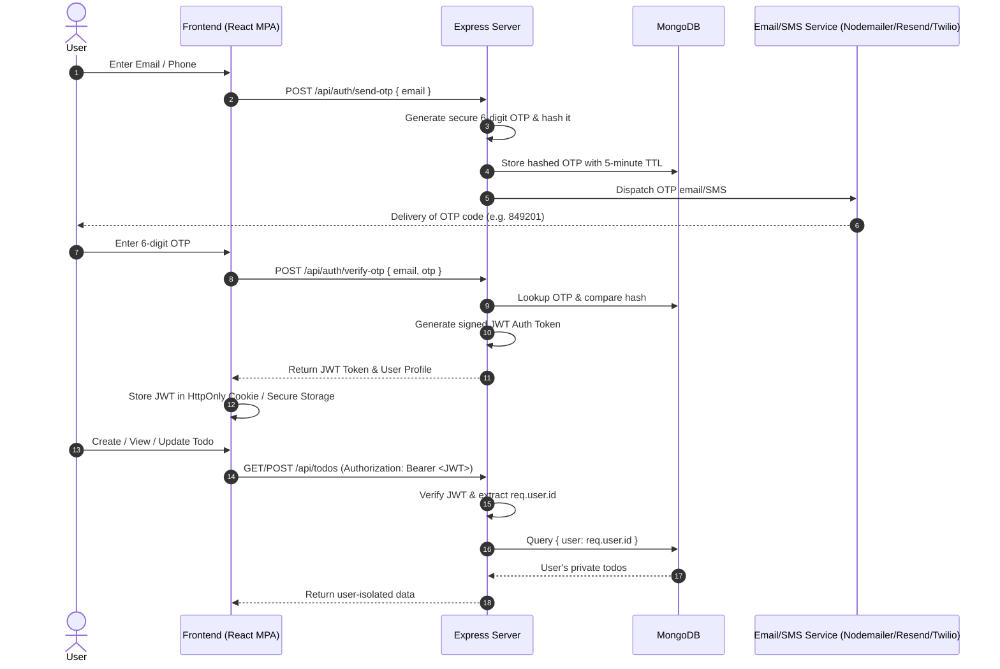

# 📋 Real-World Production Roadmap: OTP Authentication & Multi-Tenant Todo System

This roadmap details the exact steps, code recipes, database models, and security best practices needed to turn this application into a **production-ready, real-world SaaS application** featuring **secure OTP (One-Time Password) email/SMS authentication** and **user-isolated CRUD operations**.

---

## 📑 Table of Contents
1. [System Architecture Overview](#1-system-architecture-overview)
2. [Phase 1: User & OTP Authentication Backend](#2-phase-1-user--otp-authentication-backend)
3. [Phase 2: OTP Verification Frontend](#3-phase-2-otp-verification-frontend)
4. [Phase 3: User-Isolated Protected Todo CRUD](#4-phase-3-user-isolated-protected-todo-crud)
5. [Phase 4: Security, Rate Limiting & Validation](#5-phase-4-security-rate-limiting--validation)
6. [Phase 5: Cloud Database & Deployment](#6-phase-5-cloud-database--deployment)
7. [Actionable Step-by-Step Task Checklist](#7-actionable-step-by-step-task-checklist)

---

## 1. System Architecture Overview



---

## 2. Phase 1: User & OTP Authentication Backend

### 2.1 Install Authentication & Mailing Packages
Run in `server/`:
```bash
npm install jsonwebtoken bcryptjs nodemailer resend express-rate-limit
```

### 2.2 User Model (`server/models/User.js`)
Create a persistent User model:
```javascript
import mongoose from 'mongoose';

const UserSchema = new mongoose.Schema({
  name: { type: String, trim: true, default: 'Student' },
  email: { type: String, required: true, unique: true, lowercase: true, trim: true },
  phone: { type: String, trim: true },
  avatar: { type: String, default: 'https://images.unsplash.com/photo-1534528741775-53994a69daeb?w=150&auto=format&fit=crop&q=80' },
  studentId: { type: String, default: () => `ST-${Math.floor(1000 + Math.random() * 9000)}` },
  major: { type: String, default: 'Robotics & AI Engineering' },
  isVerified: { type: Boolean, default: false },
}, { timestamps: true });

export default mongoose.model('User', UserSchema);
```

### 2.3 OTP Model with Auto-Expiry (`server/models/Otp.js`)
Use MongoDB TTL (Time-To-Live) index so expired OTPs are automatically deleted:
```javascript
import mongoose from 'mongoose';

const OtpSchema = new mongoose.Schema({
  email: { type: String, required: true, lowercase: true, trim: true },
  otpHash: { type: String, required: true },
  createdAt: { type: Date, default: Date.now, expires: 300 } // Auto-deletes after 5 minutes (300s)
});

export default mongoose.model('Otp', OtpSchema);
```

### 2.4 OTP Service & Email Sender (`server/services/otpService.js`)
```javascript
import crypto from 'crypto';
import bcrypt from 'bcryptjs';
import nodemailer from 'nodemailer';
import Otp from '../models/Otp.js';

// Setup Nodemailer or Resend
const transporter = nodemailer.createTransport({
  service: 'gmail', // or AWS SES, SendGrid, Mailgun
  auth: {
    user: process.env.EMAIL_USER,
    pass: process.env.EMAIL_PASS, // App Password
  },
});

export const generateAndSendOTP = async (email) => {
  // 1. Generate cryptographically random 6-digit code
  const otp = crypto.randomInt(100000, 999999).toString();
  
  // 2. Hash OTP before saving
  const salt = await bcrypt.genSalt(10);
  const otpHash = await bcrypt.hash(otp, salt);

  // 3. Clear any existing OTP for this email and save new one
  await Otp.deleteMany({ email });
  await Otp.create({ email, otpHash });

  // 4. Send Email
  const mailOptions = {
    from: '"Smartech Security" <noreply@smartech.edu>',
    to: email,
    subject: 'Your Smartech Login Verification Code',
    html: `
      <div style="font-family: sans-serif; padding: 24px; background: #faf4f5; border-radius: 16px;">
        <h2 style="color: #624b5d;">Smartech Verification Code</h2>
        <p>Use the following 6-digit code to complete your login:</p>
        <div style="font-size: 32px; font-weight: bold; letter-spacing: 6px; color: #ec538c; padding: 12px 0;">
          ${otp}
        </div>
        <p style="color: #8c7185; font-size: 13px;">This code will expire in 5 minutes. If you did not request this, please ignore this email.</p>
      </div>
    `,
  };

  await transporter.sendMail(mailOptions);
  return true;
};

export const verifyOTP = async (email, inputOtp) => {
  const record = await Otp.findOne({ email });
  if (!record) return { valid: false, message: 'OTP expired or not found' };

  const isMatch = await bcrypt.compare(inputOtp, record.otpHash);
  if (!isMatch) return { valid: false, message: 'Invalid OTP code' };

  // Delete used OTP immediately
  await Otp.deleteOne({ _id: record._id });
  return { valid: true };
};
```

### 2.5 Auth Routes & Controller (`server/routes/authRoutes.js`)
- `POST /api/auth/send-otp`: Sends 6-digit code.
- `POST /api/auth/verify-otp`: Validates code, finds/creates User, returns signed JWT.
- `GET /api/auth/me`: Returns currently logged in user info.

### 2.6 JWT Authentication Middleware (`server/middleware/authMiddleware.js`)
```javascript
import jwt from 'jsonwebtoken';
import User from '../models/User.js';

export const requireAuth = async (req, res, next) => {
  let token;
  if (req.headers.authorization && req.headers.authorization.startsWith('Bearer')) {
    token = req.headers.authorization.split(' ')[1];
  }

  if (!token) {
    return res.status(401).json({ success: false, message: 'Not authorized, token missing' });
  }

  try {
    const decoded = jwt.verify(token, process.env.JWT_SECRET);
    req.user = await User.findById(decoded.id).select('-password');
    if (!req.user) {
      return res.status(401).json({ success: false, message: 'User no longer exists' });
    }
    next();
  } catch (err) {
    return res.status(401).json({ success: false, message: 'Invalid or expired token' });
  }
};
```

---

## 3. Phase 2: OTP Verification Frontend

### 3.1 6-Digit Auto-Focusing OTP Input UI Component
Build an interactive OTP verification step in `AuthModal.jsx`:
- 6 individual digit input boxes.
- Auto-focus next box on typing a number.
- Handle Backspace to focus previous box.
- Support pasting full 6-digit code (auto-fills all 6 boxes).
- 60-second countdown timer for **"Resend OTP"**.

```jsx
// Example OTP digit state
const [otpDigits, setOtpDigits] = useState(['', '', '', '', '', '']);

const handleDigitChange = (index, value) => {
  if (isNaN(value)) return;
  const newDigits = [...otpDigits];
  newDigits[index] = value.substring(value.length - 1);
  setOtpDigits(newDigits);

  // Auto-focus next box
  if (value && index < 5) {
    document.getElementById(`otp-input-${index + 1}`)?.focus();
  }
};
```

### 3.2 Frontend State & Token Persistence
- Store JWT Token in `localStorage` or `sessionStorage`:
  ```javascript
  localStorage.setItem('smartech_auth_token', token);
  ```
- Configure `client/src/services/api.js` to automatically attach the header:
  ```javascript
  headers: {
    'Content-Type': 'application/json',
    'Authorization': `Bearer ${localStorage.getItem('smartech_auth_token') || ''}`,
  }
  ```

---

## 4. Phase 3: User-Isolated Protected Todo CRUD

### 4.1 Update Mongoose Todo Schema with `user` reference
In `server/models/Todo.js`:
```javascript
const TodoSchema = new mongoose.Schema({
  user: {
    type: mongoose.Schema.Types.ObjectId,
    ref: 'User',
    required: true,
    index: true, // Speeds up user queries
  },
  title: { type: String, required: true },
  description: { type: String, default: '' },
  category: { type: String, default: 'Academic' },
  priority: { type: String, default: 'Medium' },
  status: { type: String, default: 'Pending' },
  isCompleted: { type: Boolean, default: false },
  dueDate: { type: Date },
  time: { type: String },
  subtasks: [SubtaskSchema],
  tags: [String],
}, { timestamps: true });
```

### 4.2 Secure All CRUD Endpoints in Controller
In `server/controllers/todoController.js`:
- **Create Todo**: Save with `user: req.user._id`.
- **Get Todos**: Query strictly with `{ user: req.user._id, ...filters }`.
- **Get Todo by ID**: Check `{ _id: id, user: req.user._id }` (prevents unauthorized access).
- **Update Todo**: Only allow updates if `todo.user.toString() === req.user._id.toString()`.
- **Delete Todo**: Only delete if `todo.user.toString() === req.user._id.toString()`.

---

## 5. Phase 4: Security, Rate Limiting & Validation

1. **Rate Limiting on OTP Endpoints**:
   - Limit `send-otp` to **3 requests per minute** per IP/email to prevent email spamming and abuse.
2. **Brute-Force Protection on OTP Verification**:
   - Lock OTP attempts after **5 failed tries**.
3. **Helmet & Security Headers**:
   ```javascript
   import helmet from 'helmet';
   app.use(helmet());
   ```
4. **Input Validation (Zod / Joi)**:
   - Validate email formats, sanitize task titles against XSS.

---

## 6. Phase 5: Cloud Database & Deployment

1. **MongoDB Atlas Setup**:
   - Create a free cluster on [MongoDB Atlas](https://www.mongodb.com/atlas).
   - Set `MONGODB_URI=mongodb+srv://<username>:<password>@cluster.mongodb.net/smartech_prod?retryWrites=true&w=majority` in `.env`.
2. **Email Provider Setup**:
   - Use [Resend](https://resend.com) or [SendGrid](https://sendgrid.com) or Gmail SMTP App Password for sending emails.
3. **Deploy Backend**:
   - Deploy Node/Express server to **Render / Railway / AWS / Heroku**.
4. **Deploy Frontend**:
   - Deploy client build (`client/dist`) to **Vercel / Netlify / Cloudflare Pages**.

---

## 7. Actionable Step-by-Step Task Checklist

### 🟧 Step 1: Authentication & Email Services
- [ ] Create `.env` variables for `EMAIL_USER`, `EMAIL_PASS`, `JWT_SECRET`, `JWT_EXPIRES_IN=7d`.
- [ ] Create `server/models/User.js` and `server/models/Otp.js` with TTL auto-expiration.
- [ ] Implement `server/services/otpService.js` to send real emails with 6-digit codes.
- [ ] Create `server/routes/authRoutes.js` (`/send-otp`, `/verify-otp`, `/me`, `/logout`).
- [ ] Create `server/middleware/authMiddleware.js` (`requireAuth`).

### 🟨 Step 2: Frontend OTP Flow
- [ ] Update `client/src/components/AuthModal.jsx` with a 2-step flow:
  1. Step 1: Enter Email address -> Click "Send OTP Code".
  2. Step 2: Enter 6-digit code with auto-focus boxes & 60s resend timer -> Click "Verify & Log In".
- [ ] Store received JWT token in `localStorage` upon successful verification.
- [ ] Attach `Authorization: Bearer <token>` to all requests in `client/src/services/api.js`.

### 🟩 Step 3: User-Isolated Protected Todo CRUD
- [ ] Link `user` ObjectId in `server/models/Todo.js`.
- [ ] Add `requireAuth` middleware to all routes in `server/routes/todoRoutes.js`.
- [ ] Update `todoController.js` to ensure users can only create, view, edit, and delete their own tasks.
- [ ] Add automatic creation of default starter tasks for new users upon first login.

### 🟦 Step 4: Security & Production Hardening
- [ ] Apply `express-rate-limit` to `/api/auth/send-otp` (max 3/min) and `/api/auth/verify-otp` (max 5/min).
- [ ] Add `helmet` and clean CORS origin configuration.
- [ ] Connect production MongoDB Atlas connection string.
- [ ] Test end-to-end OTP login and isolated todo persistence on multiple user accounts.
